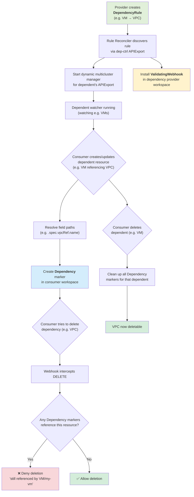

# KCP-aware Dependency Controller

## Problem Statement

In KCP, APIs can be offered to users via APIExports by a multitude of providers.
For IaaS services however there is a critical shortcoming:
IaaS APIs typically depend on each other — for example, a VM is provisioned in a VPC.
The VM is dependent on the VPC. If the VPC is deleted, it pulls the rug from under the VM.

The dependency-controller blocks the deletion of resources that still have active dependents.

## How It Works

### Lifecycle Overview



### DependencyRule

Along with their APIExport, providers create `DependencyRule` objects to describe how their
resources depend on others. A single rule attaches to one dependent resource type (via its
APIExport reference) and lists all of its dependencies with field paths that describe where
the reference lives:

```yaml
apiVersion: dependencies.opendefense.cloud/v1alpha1
kind: DependencyRule
metadata:
  name: vm-dependencies
spec:
  dependent:
    apiExportRef:
      path: root:compute-provider
      name: compute.example.com
    group: compute.example.com
    version: v1alpha1
    kind: VirtualMachine
    resource: virtualmachines
  dependencies:
    - group: network.example.com
      version: v1alpha1
      resource: vpcs
      fieldRef:
        path: ".spec.vpcRef.name"
    - group: network.example.com
      version: v1alpha1
      resource: subnets
      fieldRef:
        path: ".spec.subnetRef.name"
```

### Dependency (marker object)

When the controller observes a VM that references a VPC via the declared field path, it
automatically creates a namespaced `Dependency` marker object in the same consumer workspace:

```yaml
apiVersion: dependencies.opendefense.cloud/v1alpha1
kind: Dependency
metadata:
  name: vm-dependencies--my-vm--vpcs.my-vpc
  namespace: default
spec:
  dependent:
    group: compute.example.com
    version: v1alpha1
    resource: virtualmachines
    name: my-vm
    namespace: default
  dependency:
    group: network.example.com
    version: v1alpha1
    resource: vpcs
    name: my-vpc
    namespace: default
  ruleName: vm-dependencies
```

### Admission Webhook

A KCP ValidatingAdmissionWebhook intercepts DELETE requests. If any `Dependency` object
references the resource being deleted, the request is denied with a clear error message
listing the dependents. Finalizers are intentionally avoided as they conflict with KCP's
sync-agent.

### Architecture

The dependency-controller runs in its own workspace with its own APIExport for
`DependencyRule` and `Dependency` types. Providers and consumers bind to it.

```
Dep-Ctrl Workspace              Compute Provider WS           Network Provider WS
+------------------------+     +----------------------+      +------------------+
| APIExport:             |<----| APIBinding (dep-ctrl) |      | APIExport:       |
|   DependencyRule       |     | APIExport: compute    |      |   VPCs           |
|   Dependency           |     | DependencyRule:       |      +------------------+
|                        |     |   dependent:          |
| dependency-controller  |     |     apiExportRef:     |      Consumer WS
|  +- Rule watcher ------+-mc--+       path: root:...  |      +------------------+
|  |  (via own export)   |     |       name: compute   |<-----| APIBinding:      |
|  +- Dep watcher -------+-mc--|   deps: [vpcs]        |      |   compute        |
|  |  (via compute exp)  |     +---------------------- +      |   network        |
|  +- Webhook            |                                    |   dep-ctrl       |
+------------------------+                                    |                  |
                                                              | VPC, VM          |
                                                              | Dependency(auto) |
                                                              +------------------+
```

**Two levels of multicluster watching:**

1. **DependencyRule reconciler** watches rules via the dep-ctrl's own APIExport virtual
   workspace. It discovers provider workspaces that bind to the dep-ctrl export.

2. **Dependent watcher** (dynamic, per-rule) watches the dependent resource type (e.g., VMs)
   via the referenced APIExport's virtual workspace. For each VM, it resolves field paths
   to find dependency references and creates `Dependency` marker objects via the dep-ctrl's
   virtual workspace.

## Development

### Prerequisites

- Go 1.26+
- [kcp](https://github.com/kcp-dev/kcp) binary (for E2E tests)

### Build

```sh
make build
```

### Run Tests

```sh
# Unit tests
make test-unit

# E2E tests (requires kcp binary in PATH or TEST_KCP_ASSETS set)
make test-e2e
```

### Generate Code

```sh
make generate
```
