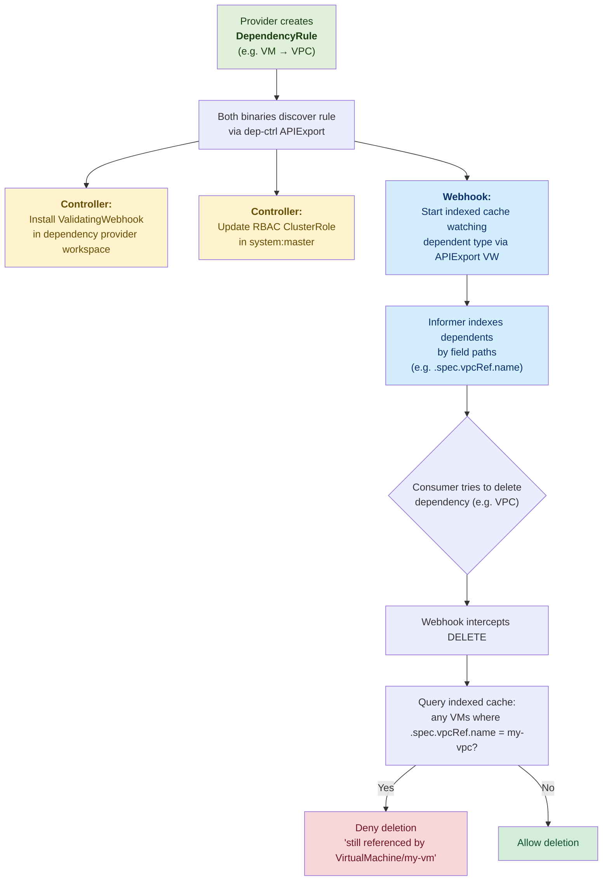
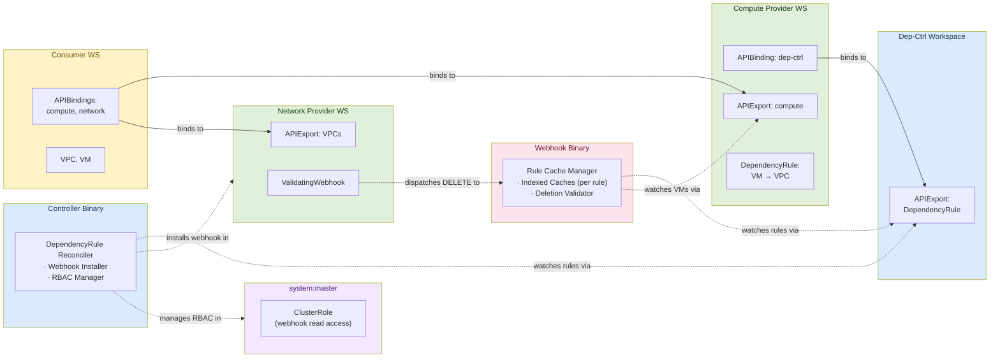

# KCP-aware Dependency Controller

## Problem Statement

In KCP, APIs can be offered to users via APIExports by a multitude of providers.
For IaaS services however there is a critical shortcoming:
IaaS APIs typically depend on each other -- for example, a VM is provisioned in a VPC.
The VM is dependent on the VPC. If the VPC is deleted, it pulls the rug from under the VM.

The dependency-controller blocks the deletion of resources that still have active dependents.

## How It Works

### Lifecycle Overview



### DependencyRule

Along with their APIExport, providers create `DependencyRule` objects to describe how their
resources depend on others. A single rule attaches to one dependent resource type (via its
APIExport reference) and lists all of its dependencies with field paths that describe where
the reference lives:

```yaml
apiVersion: dependencies.opendefense.cloud/v1alpha1
kind: DependencyRule
metadata:
  name: vm-dependencies
spec:
  dependent:
    apiExportRef:
      path: root:compute-provider
      name: compute.example.com
    group: compute.example.com
    version: v1alpha1
    kind: VirtualMachine
    resource: virtualmachines
  dependencies:
    - group: network.example.com
      version: v1alpha1
      resource: vpcs
      fieldRef:
        path: ".spec.vpcRef.name"
    - group: network.example.com
      version: v1alpha1
      resource: subnets
      fieldRef:
        path: ".spec.subnetRef.name"
```

### Two Binaries

The system runs as two independently deployable binaries that both watch
`DependencyRule` objects via the dep-ctrl APIExport:

**Controller** (`cmd/controller`) -- handles infrastructure setup:
- Installs `ValidatingWebhookConfiguration` in each provider workspace whose
  resources are protected as dependencies
- Manages a `ClusterRole` in `system:master` granting the webhook server read
  access to all dependent resource types

**Webhook** (`cmd/webhook`) -- handles admission:
- Maintains a dedicated indexed cache per rule, watching the dependent resource
  type via the provider's APIExport virtual workspace
- Serves admission requests, querying indexed caches to block deletion of
  resources that are still referenced

### Indexed Cache

For each DependencyRule, the webhook server starts a multicluster manager that watches the
dependent resource type (e.g., VirtualMachines) via the referenced APIExport's virtual
workspace. Field indices are registered on the dependent informer for each dependency
target's field path (e.g., `.spec.vpcRef.name`), enabling O(1) lookups by referenced
resource name.

### Admission Webhook

A KCP ValidatingAdmissionWebhook intercepts DELETE requests. When a delete is attempted,
the webhook queries the indexed caches to find dependent resources that reference the
resource being deleted. If any are found, the request is denied with a clear error message
listing the dependents. Finalizers are intentionally avoided as they conflict with KCP's
sync-agent.

### Architecture

The dependency-controller runs in its own workspace with its own APIExport for the
`DependencyRule` type. Providers bind to it to create rules. Consumer workspaces do
not need to bind to the dep-ctrl export.



**Two levels of multicluster watching:**

1. **DependencyRule reconciler** (both binaries) watches rules via the dep-ctrl's own
   APIExport virtual workspace, discovering provider workspaces that bind to the dep-ctrl
   export.

2. **Indexed cache** (webhook only, dynamic per-rule) watches the dependent resource type
   (e.g., VMs) via the referenced APIExport's virtual workspace. Field indices enable the
   webhook to quickly find dependents referencing a given resource.

**RBAC via system:master:** The controller maintains a ClusterRole in the `system:master`
workspace that grants the webhook server read access to all dependent resource types
declared by active rules.

For detailed architecture documentation, see [docs/architecture.md](docs/architecture.md).

## Development

### Prerequisites

- Go 1.26+
- [kcp](https://github.com/kcp-dev/kcp) binary (for integration tests)

### Build

```sh
make build
```

### Run Tests

```sh
# Unit and integration tests (requires kcp binary)
make test

# E2E tests (requires kind, helm, docker)
make test-e2e
```

### Generate Code

```sh
make generate
```
