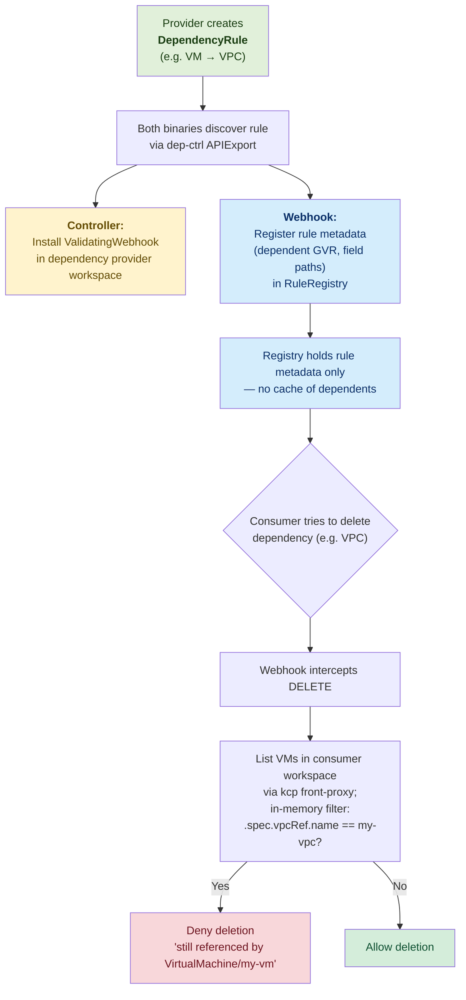
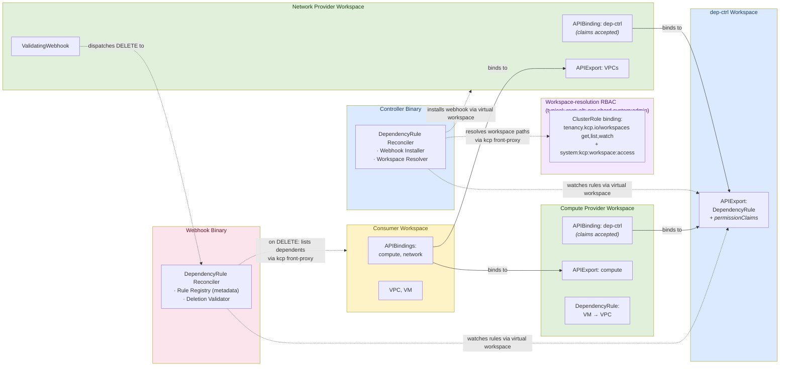

# kcp-aware Dependency Controller

[](https://github.com/opendefensecloud/dependency-controller/actions/workflows/golang.yaml)
[](https://goreportcard.com/report/go.opendefense.cloud/dependency-controller)
[](https://pkg.go.dev/go.opendefense.cloud/dependency-controller)
[](https://scorecard.dev/viewer/?uri=github.com/opendefensecloud/dependency-controller)
[](https://github.com/opendefensecloud/dependency-controller/releases/latest)

## Problem Statement

In kcp, APIs can be offered to users via APIExports by a multitude of providers.
For IaaS services however there is a critical shortcoming:
IaaS APIs typically depend on each other -- for example, a VM is provisioned in a VPC.
The VM is dependent on the VPC. If the VPC is deleted, it pulls the rug from under the VM.

The dependency-controller blocks the deletion of resources that still have active dependents.

## How It Works

### Lifecycle Overview



### DependencyRule

Along with their APIExport, providers create `DependencyRule` objects to describe how their
resources depend on others. A single rule attaches to one dependent resource type (via its
APIExport reference in the same workspace as the rule) and lists each dependency together
with the **dependency provider's** APIExport reference (workspace path + name) and the field
path inside the dependent resource where the reference lives:

```yaml
apiVersion: dependencies.opendefense.cloud/v1alpha1
kind: DependencyRule
metadata:
  name: vm-dependencies
spec:
  dependent:
    apiExportName: compute.example.com
    group: compute.example.com
    version: v1alpha1
    kind: VirtualMachine
    resource: virtualmachines
  dependencies:
    - apiExportRef:
        path: root:providers:network
        name: network.example.com
      group: network.example.com
      version: v1alpha1
      resource: vpcs
      fieldRef:
        path: ".spec.vpcRef.name"
    - apiExportRef:
        path: root:providers:network
        name: network.example.com
      group: network.example.com
      version: v1alpha1
      resource: subnets
      fieldRef:
        path: ".spec.subnetRef.name"
```

### Two Binaries

The system runs as two binaries, deployed together via a single Helm chart, that
both watch `DependencyRule` objects via the dep-ctrl APIExport:

**Controller** (`cmd/controller`) -- handles infrastructure setup:

- Installs `ValidatingWebhookConfiguration` in each provider workspace whose
  resources are protected as dependencies
- Webhook management goes through the dep-ctrl APIExport's virtual workspace,
  authorized by the `validatingwebhookconfigurations` `permissionClaim`.
  Workspace-path resolution (translating `apiExportRef.path` into a logical
  cluster name) goes through the kcp front-proxy directly, authorized by plain
  RBAC on `tenancy.kcp.io/workspaces` plus a binding to the kcp-predefined
  `system:kcp:workspace:access` ClusterRole.

**Webhook** (`cmd/webhook`) -- handles admission:

- Watches `DependencyRule` objects via the dep-ctrl APIExport's virtual
  workspace and stores parsed metadata (dependent GVR + field paths) in an
  in-memory `RuleRegistry`.
- On each DELETE admission request, finds matching rules in the registry,
  lists dependent resources directly in the consumer workspace via the kcp
  front-proxy, and filters in-memory by the configured field path to block
  deletion of still-referenced resources.

### Rule Registry

The webhook keeps an in-memory `RuleRegistry` populated by reconciling
`DependencyRule` objects through the dep-ctrl APIExport's virtual workspace.
Each entry holds rule metadata only — the dependent's GroupVersionResource
and the field paths that hold dependency references — not the dependent
resources themselves. Dependent listing happens on demand per admission
request (see [Admission Webhook](#admission-webhook) below).

### Admission Webhook

A kcp ValidatingAdmissionWebhook intercepts DELETE requests. When a delete is attempted,
the webhook looks up matching rules in the registry, builds a per-request dynamic client
targeting the consumer workspace via the kcp front-proxy
(`{base}/clusters/{logicalCluster}`), `List`s the dependent type, and filters the results
in-memory by the rule's field path. If any blocker is found, the request is denied with a
clear error message listing the dependents. Finalizers are intentionally avoided as they
conflict with kcp's sync-agent.

### Architecture

The dependency-controller runs in its own workspace with its own APIExport for the
`DependencyRule` type. Provider workspaces bind to it to create rules and to accept
the `permissionClaims` that grant the controller access to manage webhooks
in those workspaces. Consumer workspaces do not need to bind to the dep-ctrl export.



**Multicluster watching is one-level only:** both binaries watch
`DependencyRule` objects via the dep-ctrl APIExport's virtual workspace,
which spans every provider workspace bound to it. Dependent resources
(e.g., VMs) are not watched — the webhook lists them on demand from the
consumer workspace via the kcp front-proxy when validating a DELETE.

For detailed architecture documentation, see [docs/architecture.md](docs/architecture.md).
For a step-by-step deployment walkthrough, see [docs/getting-started.md](docs/getting-started.md).
For development setup and project layout, see [docs/development.md](docs/development.md).

### RBAC Model

The system relies on static bootstrap RBAC plus one `permissionClaim` declared
on the dep-ctrl APIExport. No dynamic RBAC is created at runtime.

#### permissionClaims on the dep-ctrl APIExport

The dep-ctrl APIExport declares a `permissionClaim` for:

- `validatingwebhookconfigurations` (admissionregistration.k8s.io) -- to install webhooks

Provider workspaces that bind to the dep-ctrl APIExport must **accept** this claim
in their `APIBinding` spec. This grants the controller access to manage webhooks
in binding workspaces through the virtual workspace.

#### Bootstrap RBAC (static, applied at deployment)

Three categories of static RBAC must be in place at deployment time:

**Per-shard `system:admin` RBAC (webhook)** -- grants the webhook ServiceAccount
`*/*` `get,list`. The webhook needs this during admission to list dependent
resources directly in any consumer workspace via the kcp front-proxy. Because
kcp's `BootstrapPolicyAuthorizer` reads bindings from each shard's local
`system:admin` workspace and bindings do not propagate across shards, this
binding must be applied **once per kcp shard** through a direct (non-front-proxy)
connection.

**Workspace-resolution RBAC (controller)** -- the controller needs
`tenancy.kcp.io/workspaces` `get,list,watch` plus workspace-content access — the
canonical way is to bind the kcp-predefined `system:kcp:workspace:access`
ClusterRole, which grants the `access` verb on the non-resource URL `/`. Both
must be in place in every **parent** of a workspace the controller operates on.
The controller uses these rules to translate a `DependencyRule`'s
`apiExportRef.path` (e.g., `root:providers:network`) into the underlying logical
cluster name. In a typical deployment where provider workspaces live directly
under `root`, granting them in the `root` workspace is enough; deeper paths need
the same bindings in each intermediate parent. As an alternative, the bindings
may be applied in each shard's `system:admin` workspace — those cover every
workspace on the shard and implicitly satisfy any parent the resolver needs to
traverse, at the cost of (like the webhook binding above) being applied once per
shard.

**Dep-ctrl workspace RBAC (both components)** -- both binaries need
`apis.kcp.io/apiexportendpointslices` `get,list,watch` (to discover the dep-ctrl
APIExport's virtual-workspace URLs) and `apis.kcp.io/apiexports/content` on the
dep-ctrl APIExport. The controller uses the latter to manage
`ValidatingWebhookConfiguration` objects in binding workspaces through the
virtual workspace; the webhook uses it to watch `DependencyRule` objects through
the same virtual workspace.

Webhook installation in provider workspaces is authorized by the
`validatingwebhookconfigurations` permissionClaim above, not by RBAC. Dependent
listing during admission is authorized by the per-shard `system:admin` binding,
not by the dep-ctrl APIExport.

## Development

The fastest way to get a working dev environment is the [Nix flake](flake.nix)
together with [direnv](https://direnv.net/): `direnv allow` (or `nix develop`)
drops you into a shell with Go, `golangci-lint`, `helm`, `kind`, and the kcp
toolchain on `$PATH`. After that, `pre-commit install` registers the project's
hooks.

For project layout, the full `make` target reference, integration- and e2e-test
internals, and shard-config tips, see [docs/development.md](docs/development.md).
