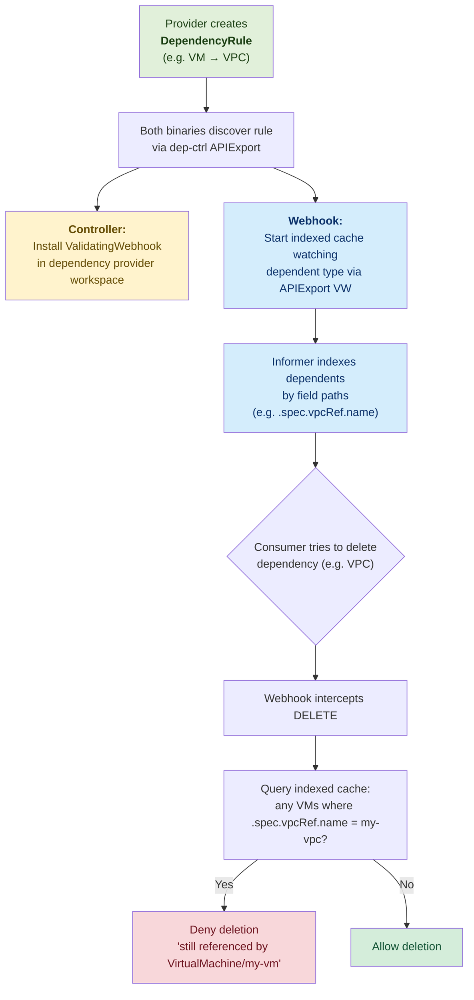
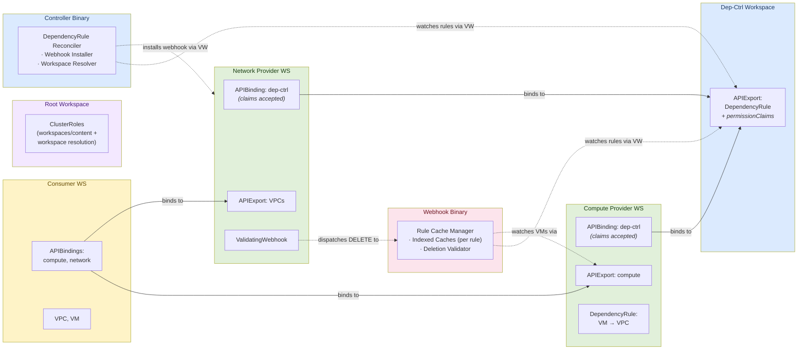

# KCP-aware Dependency Controller

[](https://scorecard.dev/viewer/?uri=github.com/opendefensecloud/dependency-controller)
[](https://github.com/opendefensecloud/dependency-controller/releases/latest)

## Problem Statement

In KCP, APIs can be offered to users via APIExports by a multitude of providers.
For IaaS services however there is a critical shortcoming:
IaaS APIs typically depend on each other -- for example, a VM is provisioned in a VPC.
The VM is dependent on the VPC. If the VPC is deleted, it pulls the rug from under the VM.

The dependency-controller blocks the deletion of resources that still have active dependents.

## How It Works

### Lifecycle Overview



### DependencyRule

Along with their APIExport, providers create `DependencyRule` objects to describe how their
resources depend on others. A single rule attaches to one dependent resource type (via its
APIExport reference) and lists all of its dependencies with field paths that describe where
the reference lives:

```yaml
apiVersion: dependencies.opendefense.cloud/v1alpha1
kind: DependencyRule
metadata:
  name: vm-dependencies
spec:
  dependent:
    apiExportName: compute.example.com
    group: compute.example.com
    version: v1alpha1
    kind: VirtualMachine
  dependencies:
    - group: network.example.com
      version: v1alpha1
      resource: vpcs
      fieldRef:
        path: ".spec.vpcRef.name"
    - group: network.example.com
      version: v1alpha1
      resource: subnets
      fieldRef:
        path: ".spec.subnetRef.name"
```

### Two Binaries

The system runs as two binaries, deployed together via a single Helm chart, that
both watch `DependencyRule` objects via the dep-ctrl APIExport:

**Controller** (`cmd/controller`) -- handles infrastructure setup:
- Installs `ValidatingWebhookConfiguration` in each provider workspace whose
  resources are protected as dependencies
- All provider workspace access goes through the dep-ctrl APIExport's virtual
  workspace, authorized by `permissionClaims` on the APIExport

**Webhook** (`cmd/webhook`) -- handles admission:
- Maintains a dedicated indexed cache per rule, watching the dependent resource
  type via the provider's APIExport virtual workspace
- Serves admission requests, querying indexed caches to block deletion of
  resources that are still referenced

### Indexed Cache

For each DependencyRule, the webhook server starts a multicluster manager that watches the
dependent resource type (e.g., VirtualMachines) via the referenced APIExport's virtual
workspace. Field indices are registered on the dependent informer for each dependency
target's field path (e.g., `.spec.vpcRef.name`), enabling O(1) lookups by referenced
resource name.

### Admission Webhook

A KCP ValidatingAdmissionWebhook intercepts DELETE requests. When a delete is attempted,
the webhook queries the indexed caches to find dependent resources that reference the
resource being deleted. If any are found, the request is denied with a clear error message
listing the dependents. Finalizers are intentionally avoided as they conflict with KCP's
sync-agent.

### Architecture

The dependency-controller runs in its own workspace with its own APIExport for the
`DependencyRule` type. Provider workspaces bind to it to create rules and to accept
the `permissionClaims` that grant the controller access to manage webhooks
in those workspaces. Consumer workspaces do not need to bind to the dep-ctrl export.



**Two levels of multicluster watching:**

1. **DependencyRule reconciler** (both binaries) watches rules via the dep-ctrl's own
   APIExport virtual workspace, discovering provider workspaces that bind to the dep-ctrl
   export.

2. **Indexed cache** (webhook only, dynamic per-rule) watches the dependent resource type
   (e.g., VMs) via the referenced APIExport's virtual workspace. Field indices enable the
   webhook to quickly find dependents referencing a given resource.

For detailed architecture documentation, see [docs/architecture.md](docs/architecture.md).
For a step-by-step deployment walkthrough, see [docs/getting-started.md](docs/getting-started.md).

### RBAC Model

The system uses static bootstrap RBAC in three kcp locations. No dynamic RBAC is
created at runtime.

#### permissionClaims on the dep-ctrl APIExport

The dep-ctrl APIExport declares a `permissionClaim` for:
- `validatingwebhookconfigurations` (admissionregistration.k8s.io) -- to install webhooks

Provider workspaces that bind to the dep-ctrl APIExport must **accept** this claim
in their `APIBinding` spec. This grants the controller access to manage webhooks
in binding workspaces through the virtual workspace.

#### Bootstrap RBAC (static, applied at deployment)

**Root workspace** -- both components need `workspaces/content` access to enter child
workspaces. The controller additionally needs `workspaces` read access to resolve
workspace paths to logical cluster names.

**Dep-ctrl workspace** -- the controller needs `apiexportendpointslices` read access
for VW URL discovery and full CRUD on `apiexports/content` to manage webhooks in
binding workspaces via the VW.

**system:admin** (per shard) -- the webhook SA gets shard-wide read access to
`apiexports/content` and `apiexportendpointslices`. This is evaluated by the Bootstrap
Policy Authorizer for every request on the shard, giving the webhook access to all
provider APIExport virtual workspaces without per-workspace RBAC. In a multi-shard
setup, this must be applied to each shard's `system:admin` independently.

See [docs/getting-started.md](docs/getting-started.md) for the full deployment guide
using [kcp-operator](https://github.com/kcp-dev/helm-charts).

## Development

### Prerequisites

- Go 1.26+
- [kcp](https://github.com/kcp-dev/kcp) binary (for integration tests)

### Build

```sh
make build
```

### Run Tests

```sh
# Unit and integration tests (requires kcp binary)
make test

# E2E tests (requires kind, helm, docker)
# Deploys a multi-shard kcp via kcp-operator (root + shard1)
make test-e2e
```

### Generate Code

```sh
make generate
```
