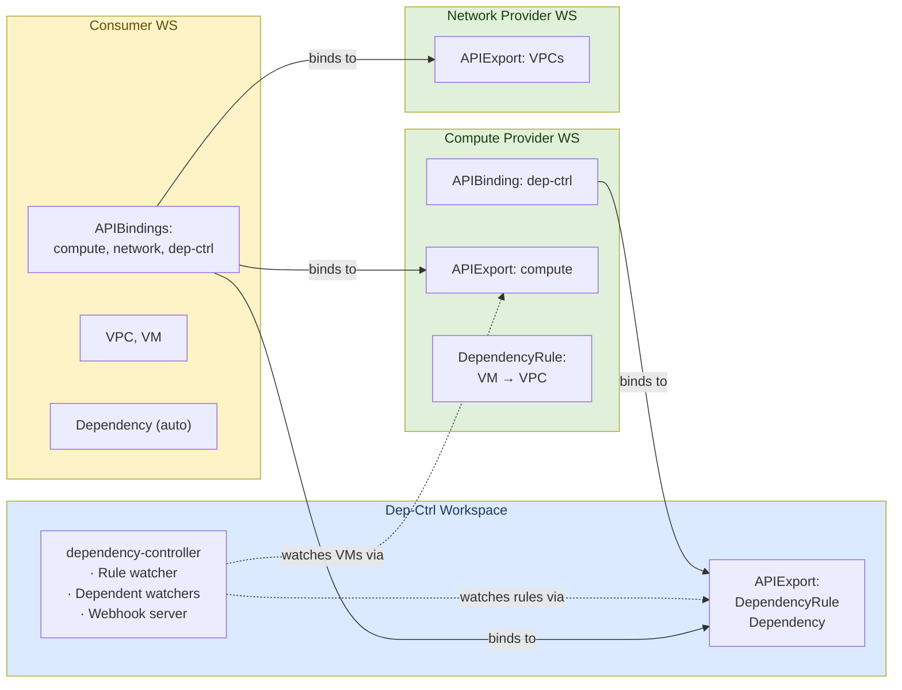
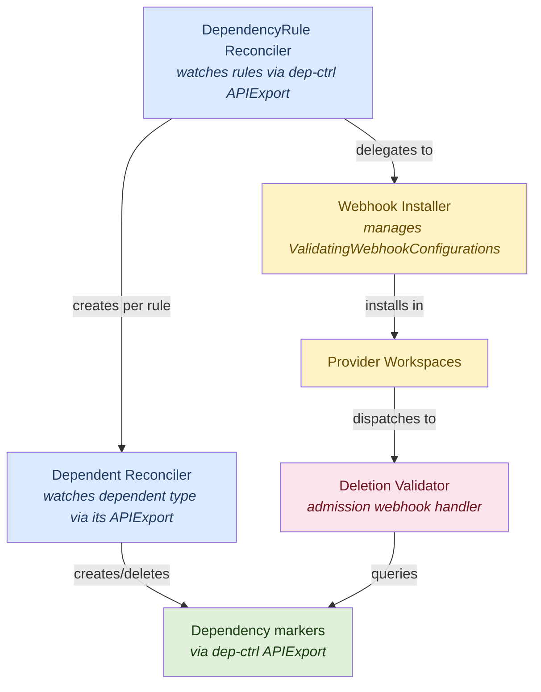
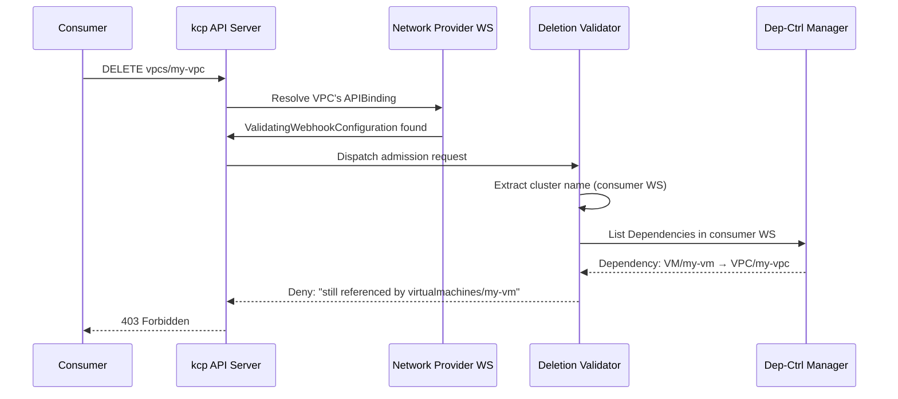
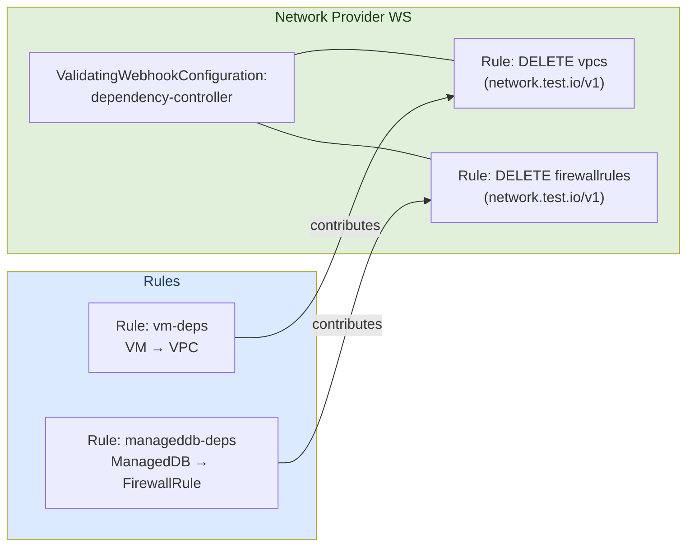

# Architecture

The dependency-controller is a centralized platform service for [kcp](https://kcp.io) that
tracks cross-resource dependencies and prevents deletion of resources that are still in use.

## Problem

In a multi-tenant kcp environment, different API providers export resource types
(VPCs, VirtualMachines, ManagedDBs, ...) from separate workspaces. Consumer
workspaces bind to multiple providers and create resources that reference each
other -- a VirtualMachine references a VPC by name, a ManagedDB references a
FirewallRule, etc.

Without coordination, deleting a VPC that is still referenced by a
VirtualMachine leaves the VM in a broken state. The dependency-controller solves
this by:

1. Automatically discovering cross-resource references
2. Creating `Dependency` marker objects that record each relationship
3. Installing admission webhooks that block deletion of resources with active dependents

## Workspace Topology

The system uses three workspace roles. Each runs independently and communicates
through kcp's APIExport/APIBinding mechanism.



**Dep-ctrl workspace** -- hosts the controller and its APIExport
(`dependencies.opendefense.cloud`), which provides the `DependencyRule` and
`Dependency` custom resource types.

**Provider workspaces** -- each provider (compute, network, ...) has its own
APIExport for the resources it provides. Providers bind to the dep-ctrl
APIExport and create `DependencyRule` objects that declare how their resources
reference other providers' resources.

**Consumer workspaces** -- bind to all relevant providers plus dep-ctrl.
Resources (VPCs, VMs) are created here. `Dependency` marker objects are
automatically created by the controller in the same workspace.

## Components



### DependencyRule Reconciler

**File:** `internal/controller/dependencyrule_controller.go`

The top-level controller. It watches `DependencyRule` objects across all
workspaces that bind to the dep-ctrl APIExport, using a multicluster manager
with an `apiexport` provider.

On reconcile it:

1. **Ensures a dependent watcher** -- for each DependencyRule, it creates a
   dedicated multicluster manager backed by the referenced APIExport's virtual
   workspace. A `DependentReconciler` is registered on this manager to watch
   the dependent resource type.

2. **Ensures webhooks** -- delegates to the `WebhookInstaller` to create or
   update `ValidatingWebhookConfiguration` objects in provider workspaces.

On deletion it:

1. **Removes webhook rules** -- calls `WebhookInstaller.RemoveWebhooks` to
   remove the rule's contributions. If no rules remain for a workspace, the
   webhook is deleted entirely.

2. **Cleans up Dependencies** -- calls `DependentReconciler.CleanupAll` to
   actively delete all Dependency objects created by this rule across every
   cluster the reconciler has seen.

3. **Stops the manager** -- cancels the rule's manager context, which tears
   down the controller, informer watch, and all associated goroutines.

#### Per-Rule Manager Lifecycle

Each DependencyRule gets its own `mcmanager.Manager`. This 1:1 mapping ensures
clean lifecycle management: when a rule is deleted, its manager can be cancelled
without affecting other rules — even if two rules reference the same APIExport.

Managers are keyed by rule name in the `ruleState` map and started in background
goroutines. On deletion, the reconciler first performs active cleanup (deleting
Dependencies), then cancels the manager context to stop the watch.

### Dependent Reconciler

**File:** `internal/controller/dependent_controller.go`

Watches a specific dependent resource type (e.g., VirtualMachines) through a
dynamic multicluster manager. Uses two managers:

- **DependentManager** -- reads dependent resources via the dependent's
  APIExport virtual workspace
- **DepCtrlManager** -- creates/deletes `Dependency` objects via the dep-ctrl's
  APIExport virtual workspace

Both managers discover the same consumer workspaces (by logical cluster name),
so cross-manager operations work.

#### Cluster Tracking

The reconciler maintains a `knownClusters` set (protected by a mutex) that
records every cluster name where it has seen dependent resources. This set is
used during cleanup to find and delete Dependencies across all workspaces
without relying on a subsequent reconcile event.

On reconcile it:

1. Tracks the cluster name in `knownClusters`
2. Fetches the dependent resource as `Unstructured`
3. For each dependency target in the rule, resolves the field path (e.g.,
   `.spec.vpcRef.name`) to get the referenced resource name
4. Creates a `Dependency` marker object in the consumer workspace if one doesn't
   exist
5. Cleans up stale `Dependency` objects if references changed

On dependent deletion:

1. Deletes all `Dependency` objects associated with that dependent (matched by
   labels)

On rule deletion (`CleanupAll`):

1. Iterates all known clusters
2. In each cluster, lists all Dependencies matching the rule's label
3. Deletes each Dependency individually (list-then-delete rather than
   `DeleteAllOf`, since `DeleteAllOf` without a namespace only targets the
   default namespace for namespace-scoped resources)

### Webhook Installer

**File:** `internal/controller/webhook_installer.go`

Manages `ValidatingWebhookConfiguration` objects in provider workspaces. Each
provider workspace gets at most one webhook named `dependency-controller`, with
rules merged from all DependencyRules that target resources in that workspace.

Key design:

- **Ownership tracking** -- maintains `ruleTargets map[string][]ruleTarget`
  keyed by DependencyRule name, so each rule's contributions can be
  independently added or removed.

- **Full reconciliation** -- on any change, recomputes the complete desired
  state for the affected workspace by unioning all remaining rules' targets.
  This avoids incremental bookkeeping bugs.

- **Deduplication** -- if two rules both protect VPCs from the same provider,
  only one webhook rule entry is created.

- **Cleanup** -- when a DependencyRule is deleted and no rules remain for a
  workspace, the entire webhook is deleted.

### Deletion Validator (Webhook Handler)

**File:** `internal/webhook/deletion_validator.go`

The admission webhook handler. Registered as an HTTPS endpoint that kcp's
admission system dispatches to.

On a DELETE request it:

1. Extracts the logical cluster name from the `kcp.io/cluster` annotation on the
   object being deleted
2. Uses the dep-ctrl manager's cluster client to list `Dependency` objects in
   that consumer workspace
3. Checks if any Dependency references the resource being deleted
4. Denies the request with a descriptive message if active dependents exist

The handler is multicluster-aware and rule-agnostic -- it doesn't need to know
which DependencyRule created the Dependencies.

### Field Path Resolution

**File:** `internal/webhook/fieldpath.go`

Resolves dot-notation paths (e.g., `.spec.vpcRef.name`) against unstructured
objects to extract dependency references. Used by the `DependentReconciler` to
find which resources a dependent references.

## API Types

**File:** `api/v1alpha1/types.go`

### DependencyRule (cluster-scoped)

Created by API providers alongside their APIExport. Declares how a dependent
resource type references other resource types.

```yaml
apiVersion: dependencies.opendefense.cloud/v1alpha1
kind: DependencyRule
metadata:
  name: vm-dependencies
spec:
  dependent:
    apiExportRef:
      path: "root:compute-provider"
      name: "compute.test.io"
    group: compute.test.io
    version: v1
    kind: VirtualMachine
    resource: virtualmachines
  dependencies:
    - apiExportRef:
        path: "root:network-provider"
        name: "network.test.io"
      group: network.test.io
      version: v1
      resource: vpcs
      fieldRef:
        path: ".spec.vpcRef.name"
```

### Dependency (namespace-scoped)

Automatically created by the controller. Records a specific dependency between
two resource instances.

```yaml
apiVersion: dependencies.opendefense.cloud/v1alpha1
kind: Dependency
metadata:
  name: vm-dependencies--my-vm--vpcs.my-vpc
  namespace: default
  labels:
    dependencies.opendefense.cloud/rule: vm-dependencies
    dependencies.opendefense.cloud/rule-cluster: 2hx4p3vhfj9ac
    dependencies.opendefense.cloud/dependent-name: my-vm
spec:
  dependent:
    group: compute.test.io
    version: v1
    resource: virtualmachines
    name: my-vm
  dependency:
    group: network.test.io
    version: v1
    resource: vpcs
    name: my-vpc
  ruleRef:
    name: vm-dependencies
    cluster: 2hx4p3vhfj9ac  # logical cluster name of the compute-provider workspace
```

## Webhook Dispatch Flow

kcp's admission webhook system routes requests through provider workspaces:



## Multi-Rule Webhook Merging

When multiple DependencyRules target the same provider workspace (e.g., both VM
and ManagedDB depend on resources from the network provider), the webhook
installer merges them into a single webhook:



Deleting one rule removes only its contributions. The webhook is updated to
reflect the remaining rules. When the last rule for a workspace is deleted, the
webhook is removed entirely.

## Force-Deleting Protected Resources

If the normal dependency lifecycle has broken down (e.g., stale Dependency
markers, crashed controller, orphaned Dependencies), operators can bypass
deletion protection by annotating the resource:

```sh
kubectl annotate vpc my-vpc dependencies.opendefense.cloud/skip-protection=true
kubectl delete vpc my-vpc
```

The webhook checks for this annotation and allows deletion regardless of
active Dependencies.

## Known Limitations

### Circular dependencies

The controller does not detect circular dependency chains. If two
DependencyRules create a cycle (e.g., rule A declares VM depends on VPC and
rule B declares VPC depends on VM), neither resource can be deleted through
normal means. Operators must use the `skip-protection` annotation to break
the cycle.

### Eventual consistency gap on creation

Between the moment a dependent resource is created (e.g., a VM referencing a
VPC) and the moment the controller reconciles it (creating the Dependency
marker), the dependency resource can be deleted without the webhook blocking
it. This window is typically sub-second but is inherent to the asynchronous
reconciliation model. The Dependency objects act as a pre-computed index that
makes webhook decisions fast; doing synchronous lookups in the admission path
would require the webhook to hold references to every dynamic APIExport
manager and would add significant latency to every DELETE request.
