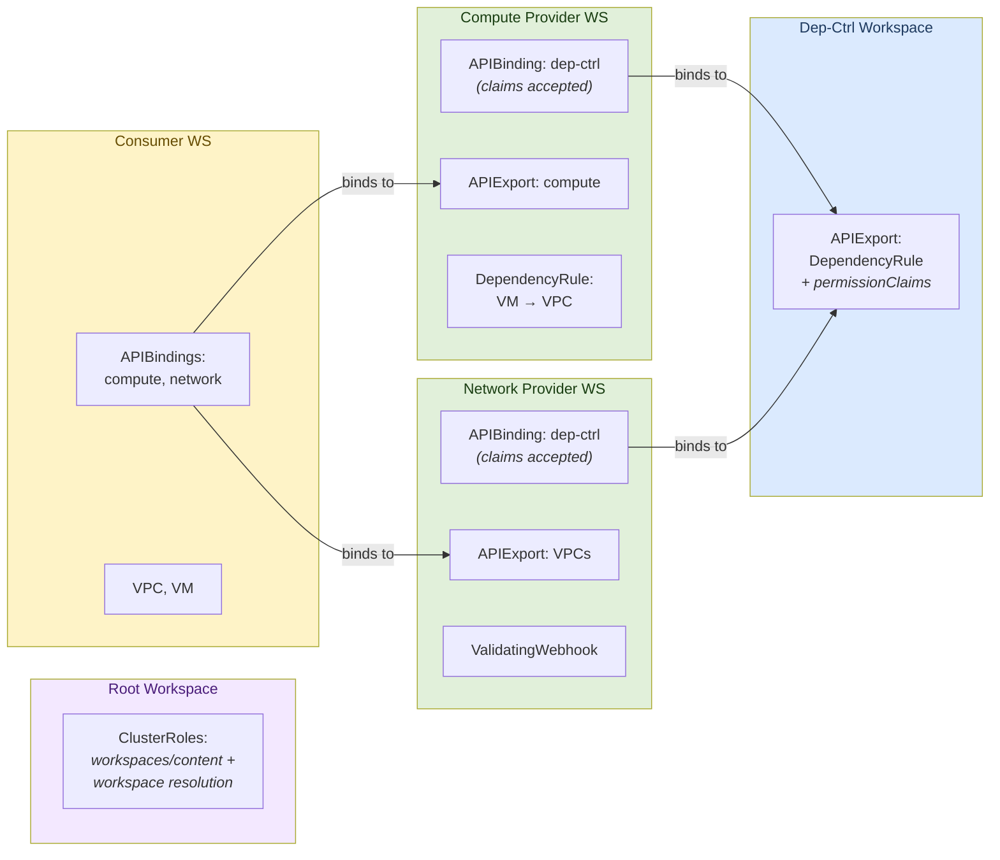
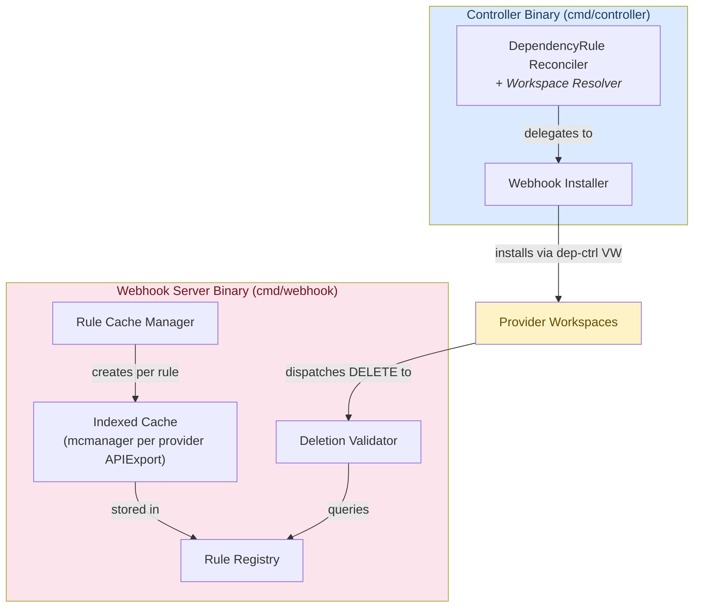

# Architecture

The dependency-controller prevents deletion of resources that are still referenced
by other resources in a multi-tenant [kcp](https://kcp.io) environment.

## Problem

Different API providers export resource types (VPCs, VirtualMachines, ManagedDBs, ...)
from separate kcp workspaces. Consumer workspaces bind to multiple providers and
create resources that reference each other -- a VirtualMachine references a VPC by
name, a ManagedDB references a FirewallRule, etc.

Without coordination, deleting a VPC that is still referenced by a VirtualMachine
leaves the VM in a broken state.

The system solves this with two cooperating binaries:

- **Controller** -- watches `DependencyRule` objects and installs admission webhooks
  in provider workspaces
- **Webhook** -- maintains indexed caches of dependent resources and serves
  admission requests that block deletion of still-referenced resources

## Workspace Topology



**Dep-ctrl workspace** -- hosts the `DependencyRule` APIExport
(`dependencies.opendefense.cloud`) with a `permissionClaim` for
`validatingwebhookconfigurations`. Both the controller and webhook connect to
this workspace's virtual workspace to discover rules. The controller also uses
the virtual workspace to manage webhooks in binding workspaces (authorized by
the permissionClaim).

**Provider workspaces** -- each provider (compute, network, ...) exports its own
resource types and binds to the dep-ctrl APIExport to create `DependencyRule`
objects. The APIBinding must **accept** the dep-ctrl's permissionClaim, which
grants the controller access to manage `ValidatingWebhookConfigurations` in
those workspaces through the virtual workspace.

**Consumer workspaces** -- bind to provider exports and create the actual
resources (VPCs, VMs). Consumers don't interact with the dependency system directly.

**Root workspace** -- hosts static `ClusterRoles` granting both components
`workspaces/content` access (needed to enter child workspaces). The controller
additionally gets `workspaces` read access to resolve workspace paths to logical
cluster names. This is a deployment prerequisite.

## Component Overview



---

## Controller

**Entry point:** [`cmd/controller/main.go`](../cmd/controller/main.go)

The controller watches `DependencyRule` objects and ensures admission webhooks
exist in the right provider workspaces. The webhook's read access to dependent
resources is granted shard-wide via `system:admin` bootstrap RBAC, so the
controller only handles webhook installation.

All operations in provider workspaces are routed through the dep-ctrl APIExport's
virtual workspace, authorized by `permissionClaims`. The controller never connects
directly to provider workspaces.

### Initialization and Workspace Resolution

On first reconcile, the controller lazily initializes two components
([`ensureInitialized`](../internal/controller/dependencyrule_controller.go)):

1. **VW URL discovery** -- reads the `APIExportEndpointSlice` for the dep-ctrl
   APIExport to find the virtual workspace base URL
2. **Workspace resolver** -- resolves workspace paths (e.g., `root:network-provider`)
   to logical cluster names (e.g., `qh6707jkfsen31z9`) by reading `Workspace`
   objects from the root workspace (`ws.Spec.Cluster`)

The VW only accepts logical cluster names in its `/clusters/<name>` path, not
workspace paths. The resolver caches mappings and is consulted before every
webhook or RBAC operation.

### How a DependencyRule becomes a webhook

When a provider creates a `DependencyRule` ([`api/v1alpha1/types.go`](../api/v1alpha1/types.go)),
the controller's reconciler
([`internal/controller/dependencyrule_controller.go:Reconcile`](../internal/controller/dependencyrule_controller.go))
picks it up via the dep-ctrl APIExport's virtual workspace and performs two actions:

#### 1. Webhook Installation

The [`WebhookInstaller`](../internal/controller/webhook_installer.go) creates or
updates a `ValidatingWebhookConfiguration` named `dependency-controller` in each
provider workspace whose resources are referenced as dependencies.

The rule's `spec.dependencies[].apiExportRef.path` determines which workspace to
target. The reconciler resolves the path to a logical cluster name and sets the
installer's `BaseConfig` to the dep-ctrl VW URL, so the installer connects via
`<vw-url>/clusters/<logical-cluster-name>`. The `permissionClaims` on the dep-ctrl
APIExport authorize creating `ValidatingWebhookConfigurations` in the binding
workspace.

The installer groups all dependency targets by workspace and merges them
into a single webhook per workspace
([`reconcileWorkspaceWebhook`](../internal/controller/webhook_installer.go)).

For example, if two DependencyRules both protect resources from the network
provider, the installer creates one webhook in the network provider's workspace
with two `rules` entries (one per protected GVR). This merging is tracked via
`ruleTargets map[string][]ruleTarget` -- keyed by DependencyRule, so each rule's
contributions can be independently added or removed. On any change,
[`desiredRulesForWorkspace`](../internal/controller/webhook_installer.go)
recomputes the full desired state from scratch to avoid incremental bookkeeping bugs.

When a DependencyRule is deleted
([`handleDeletion`](../internal/controller/dependencyrule_controller.go)),
the installer removes that rule's contributions. If no rules remain for a
workspace, the webhook is deleted entirely.

---

## Webhook

**Entry point:** [`cmd/webhook/main.go`](../cmd/webhook/main.go)

The webhook server watches the same `DependencyRule` objects as the controller,
but its job is different: it builds indexed caches of dependent resources and uses
them to answer admission requests.

### Startup and Prewarming

On startup, the webhook creates an `mcmanager` backed by the dep-ctrl APIExport
provider, then registers the
[`RuleCacheManager`](../internal/webhook/rule_cache_manager.go) as a controller
watching `DependencyRule` objects.

Before the webhook can serve requests safely, it must populate its caches from
all existing rules. This happens in a
[`manager.RunnableFunc`](../cmd/webhook/main.go) that runs after the manager
starts:

1. [`PopulateRegistry`](../internal/webhook/rule_cache_manager.go) resolves
   the dep-ctrl APIExport's virtual workspace URL from its
   `APIExportEndpointSlice`
   ([`virtualWorkspaceClient`](../internal/webhook/rule_cache_manager.go))
2. Lists all existing `DependencyRule` objects across all bound workspaces
3. Calls [`ensureCache`](../internal/webhook/rule_cache_manager.go) for each rule
4. Closes the `initialized` channel

Until `initialized` is closed:
- The readyz probe ([`ReadyzCheck`](../internal/webhook/deletion_validator.go))
  returns unhealthy
- The `DeletionValidator` denies all DELETE requests with "not yet initialized"

### Per-Rule Indexed Caches

Each `DependencyRule` gets a dedicated `mcmanager.Manager` connected to the
dependent resource's provider APIExport virtual workspace. This 1:1 mapping
([`ensureCache`](../internal/webhook/rule_cache_manager.go)) exists because:

- **Different rules reference different APIExports** -- each provider's virtual
  workspace is a distinct endpoint, so each needs its own manager
- **Clean lifecycle** -- cancelling one rule's context tears down only its
  informers, without affecting other rules

For each dependency target in the rule,
[`ensureCache`](../internal/webhook/rule_cache_manager.go) registers a field
index on the dependent resource's informer:

```go
mgr.GetFieldIndexer().IndexField(ctx, watchObj, fieldPath, func(obj client.Object) []string {
    val := fieldpath.Resolve(u.Object, fieldPath)  // e.g., ".spec.vpcRef.name" -> "my-vpc"
    return []string{val}
})
```

This enables O(1) lookups: "find all VMs whose `.spec.vpcRef.name` equals `my-vpc`".

A minimal controller is registered on the same GVK to activate the informer
(controller-runtime won't start an informer without a controller watching it)
and to track which logical clusters have been discovered and mark the cache
as ready.

The resulting state is stored in the
[`RuleRegistry`](../internal/webhook/rule_registry.go) as a `RuleState` keyed by
`clusterName/ruleName`. The registry also maintains a reverse index
(`byTarget map[GVR][]string`) so the webhook can quickly find which rules
protect a given resource type.

On `DependencyRule` deletion, `Reconcile` calls
[`Registry.Unregister(key)`](../internal/webhook/rule_registry.go) which removes
the state from the map and calls `state.Cancel()` to stop the background manager
goroutine and tear down all informers.

### Admission Request Flow

When kcp dispatches a DELETE request to the webhook, the
[`DeletionValidator.Handle`](../internal/webhook/deletion_validator.go)
method processes it:

```
DELETE vpcs/my-vpc (from consumer workspace)
   |
   v
1. Non-DELETE? --> Allow
   |
2. Not initialized? --> Deny ("retry later")
   |
3. Parse object from request (OldObject for DELETE)
   |
4. Has skip-protection annotation? --> Allow
   |
5. Extract logical cluster name from kcp.io/cluster annotation
   |
6. Registry.FindByTargetGVR(vpcs GVR)
   |  returns []RuleEntry with matched IndexedFields
   |
7. For each matching rule:
   |  a. Cache not ready? --> Deny ("cache warming up, retry later")
   |  b. Get cluster from rule's manager
   |  c. Query: cache.List(ctx, &list, MatchingFields{".spec.vpcRef.name": "my-vpc"})
   |  d. Each result is a blocker: "VirtualMachine/my-vm"
   |
8. Blockers found? --> Deny ("still referenced by VirtualMachine/my-vm")
   |
9. No blockers --> Allow
```

The validator is rule-agnostic -- it doesn't need to know the structure of each
`DependencyRule`, only how to query the indexed caches via the field paths stored
in `RuleEntry.MatchedField`.

### Force-Deleting Protected Resources

If the dependency lifecycle has broken down (stale caches, crashed webhook),
operators can bypass protection:

```sh
kubectl annotate vpc my-vpc dependencies.opendefense.cloud/skip-protection=true
kubectl delete vpc my-vpc
```

The webhook checks for this annotation
([`AnnotationSkipProtection`](../internal/webhook/deletion_validator.go))
early in the handler and allows deletion regardless of active dependents.

---

## Key Data Structures

### DependencyRule (`api/v1alpha1/types.go`)

```yaml
apiVersion: dependencies.opendefense.cloud/v1alpha1
kind: DependencyRule
metadata:
  name: vm-dependencies
spec:
  dependent:
    apiExportRef:
      path: "root:compute-provider"
      name: "compute.test.io"
    group: compute.test.io
    version: v1
    kind: VirtualMachine
    resource: virtualmachines
  dependencies:
    - apiExportRef:
        path: "root:network-provider"
        name: "network.test.io"
      group: network.test.io
      version: v1
      resource: vpcs
      fieldRef:
        path: ".spec.vpcRef.name"
```

`spec.dependent` -- the resource type that holds references (the one being cached).
`spec.dependent.apiExportRef` -- where to find this type's virtual workspace.
`spec.dependencies[]` -- the resource types being referenced (the ones being protected).
`spec.dependencies[].fieldRef.path` -- where in the dependent resource the reference lives.

### RuleRegistry (`internal/webhook/rule_registry.go`)

Thread-safe store shared between the `RuleCacheManager` (writer) and
`DeletionValidator` (reader).

- `rules map[string]*RuleState` -- keyed by `clusterName/ruleName`
- `byTarget map[GVR][]string` -- reverse index from protected GVR to rule keys,
  rebuilt on every `Register`/`Unregister`

Key operations:
- `Register(key, state) *RuleState` -- adds/replaces a rule, returns old state for cleanup
- `Unregister(key)` -- removes and cancels the rule's manager
- `FindByTargetGVR(gvr) []RuleEntry` -- O(1) lookup used by the admission handler

### Field Path Resolution (`internal/fieldpath/fieldpath.go`)

[`fieldpath.Resolve`](../internal/fieldpath/fieldpath.go) extracts a string value
from an unstructured object given a dot-notation path (e.g., `.spec.vpcRef.name`).
Used by the index functions registered on per-rule informers.

---

## Known Limitations

### Circular dependencies

The system does not detect cycles. If rule A says VM depends on VPC and rule B
says VPC depends on VM, neither can be deleted normally. Use `skip-protection`
to break the cycle.

### Informer cache lag

Between a dependent being created and the informer cache syncing (typically
sub-second), the referenced resource can be deleted without the webhook blocking
it. Similarly, after a dependent is deleted, there's a brief window where the
webhook may still block deletion of the referenced resource.

### Rule updates are not detected

[`ensureCache`](../internal/webhook/rule_cache_manager.go) is a no-op if a
cache already exists for the rule key. If a `DependencyRule`'s spec changes
(e.g., a new dependency target is added), the existing cache won't be updated.
The workaround is to delete and recreate the rule.
