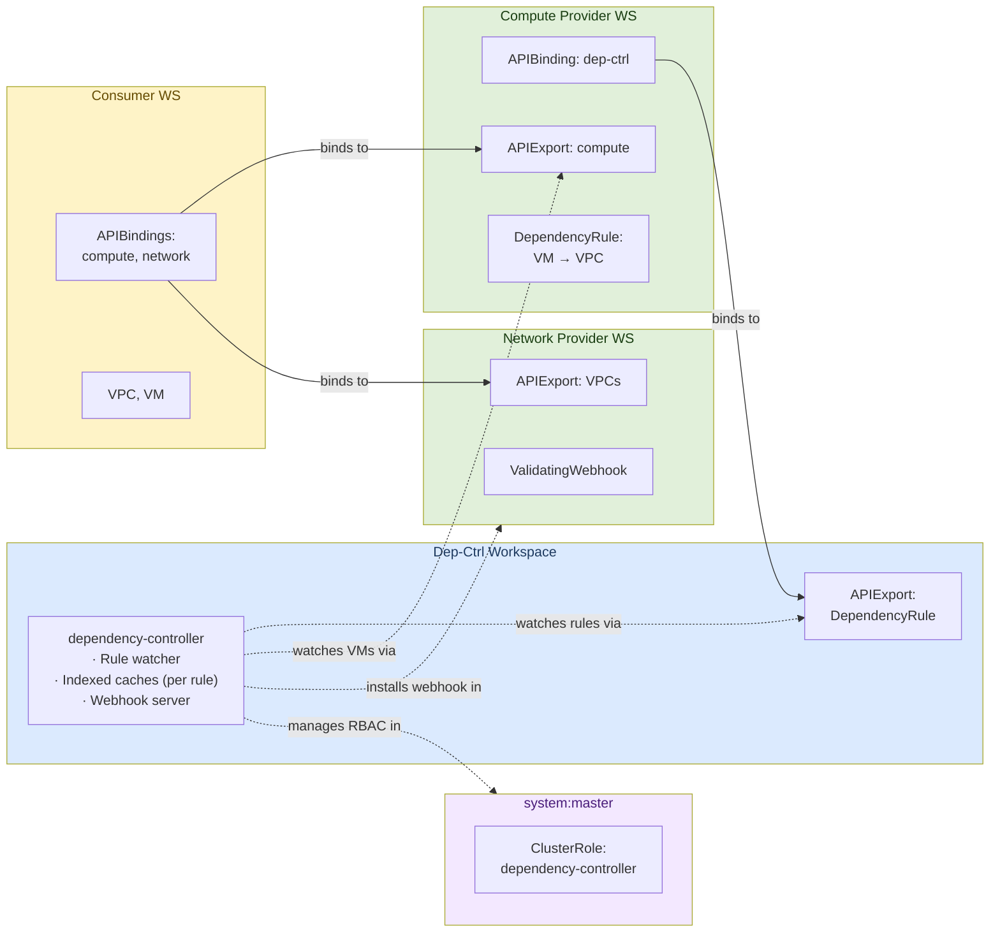
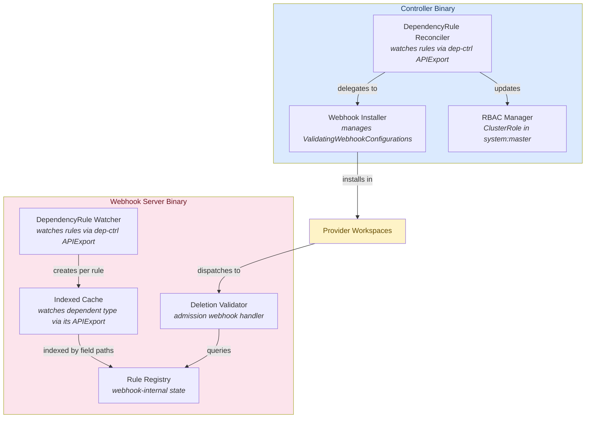
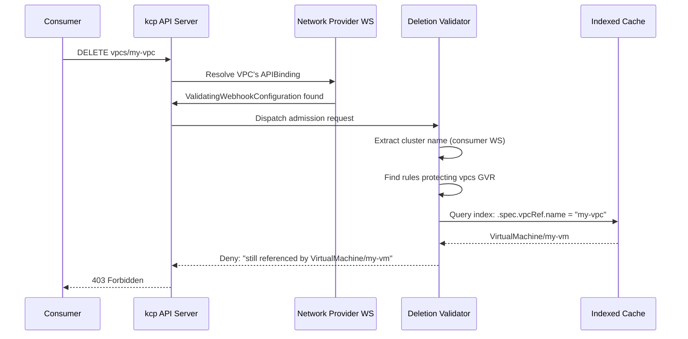
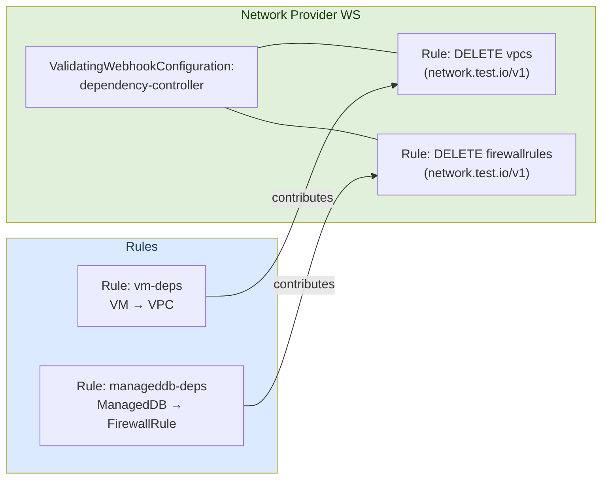

# Architecture

The dependency-controller is a centralized platform service for [kcp](https://kcp.io) that
tracks cross-resource dependencies and prevents deletion of resources that are still in use.

## Problem

In a multi-tenant kcp environment, different API providers export resource types
(VPCs, VirtualMachines, ManagedDBs, ...) from separate workspaces. Consumer
workspaces bind to multiple providers and create resources that reference each
other -- a VirtualMachine references a VPC by name, a ManagedDB references a
FirewallRule, etc.

Without coordination, deleting a VPC that is still referenced by a
VirtualMachine leaves the VM in a broken state. The dependency-controller solves
this by:

1. Watching dependent resource types and indexing their references
2. Installing admission webhooks that block deletion of resources with active dependents
3. Querying indexed caches at admission time for instant dependency resolution

## Workspace Topology

The system uses three workspace roles. Each runs independently and communicates
through kcp's APIExport/APIBinding mechanism.



**Dep-ctrl workspace** -- hosts the controller and its APIExport
(`dependencies.opendefense.cloud`), which provides the `DependencyRule`
custom resource type.

**Provider workspaces** -- each provider (compute, network, ...) has its own
APIExport for the resources it provides. Providers bind to the dep-ctrl
APIExport and create `DependencyRule` objects that declare how their resources
reference other providers' resources.

**Consumer workspaces** -- bind to the relevant provider exports (network,
compute, etc.). Resources (VPCs, VMs) are created here. Consumers do not
need to bind to the dep-ctrl export.

**system:master** -- hosts a centralized `ClusterRole` that grants the
dependency-controller read access to all dependent resource types across
all workspaces. This role is dynamically updated as DependencyRules are
created or deleted.

## Components



The controller and webhook server are independently deployable. The controller
handles webhook installation and RBAC management. The webhook server watches
DependencyRules, manages per-rule indexed caches, and serves admission requests.

### DependencyRule Reconciler (Controller)

**File:** `internal/controller/dependencyrule_controller.go`

Watches `DependencyRule` objects across all workspaces that bind to the dep-ctrl
APIExport, using a multicluster manager with an `apiexport` provider.

On reconcile it:

1. **Ensures webhooks** -- delegates to the `WebhookInstaller` to create or
   update `ValidatingWebhookConfiguration` objects in provider workspaces.

2. **Updates RBAC** -- calls `RBACManager.Reconcile()` to update the
   ClusterRole in `system:master` with the current set of dependent GVRs.

On deletion it:

1. **Removes webhook rules** -- calls `WebhookInstaller.RemoveWebhooks` to
   remove the rule's contributions. If no rules remain for a workspace, the
   webhook is deleted entirely.

2. **Updates RBAC** -- reconciles the ClusterRole to remove the deleted
   rule's dependent GVR if no other rules reference it.

### DependencyRule Watcher (Webhook Server)

**File:** `internal/webhook/rule_watcher.go`

Watches `DependencyRule` objects via the dep-ctrl APIExport and manages per-rule
multicluster managers with indexed caches. Runs inside the webhook server binary.

On reconcile it:

1. **Ensures an indexed cache** -- for each DependencyRule, creates a
   dedicated multicluster manager backed by the referenced APIExport's virtual
   workspace. Field indices are registered on the dependent informer for each
   dependency target's field path (e.g., `.spec.vpcRef.name`). The manager
   and indices are stored in the `RuleRegistry`.

On deletion it:

1. **Unregisters from the registry** -- removes the rule from the
   `RuleRegistry`, which cancels the manager context, tearing down the
   informer watch and all associated goroutines.

#### Per-Rule Manager Lifecycle

Each DependencyRule gets its own `mcmanager.Manager`. This 1:1 mapping ensures
clean lifecycle management: when a rule is deleted, its manager can be cancelled
without affecting other rules -- even if two rules reference the same APIExport.

Managers are keyed by `clusterName/ruleName` in the `RuleRegistry` and started
in background goroutines. On deletion, the watcher unregisters from the
registry which cancels the manager context.

### Rule Registry

**File:** `internal/webhook/rule_registry.go`

Thread-safe shared state between the reconciler and the webhook. Maintains:

- **Rule map** (`rules`): keyed by `clusterName/ruleName`, stores the per-rule
  manager, dependent GVK, indexed fields, and readiness status.
- **Reverse index** (`byTarget`): maps dependency target GVRs to rule keys,
  enabling O(1) lookup of which rules protect a given resource type.

Key methods:

- `Register(key, state)` -- adds a rule and rebuilds the reverse index
- `Unregister(key)` -- removes a rule, cancels its manager, rebuilds the index
- `FindByTargetGVR(gvr)` -- returns rule entries with matching indexed fields

### RBAC Manager

**File:** `internal/controller/rbac_manager.go`

Manages a `ClusterRole` and `ClusterRoleBinding` in the `system:master`
workspace. The ClusterRole lists all dependent resource GVRs (with get/list/watch
verbs) from active DependencyRules, grouped by API group for compact rules.

Called by the DependencyRule reconciler after any rule change (creation or
deletion). The ClusterRoleBinding is created once and binds the controller's
service account to the role.

### Webhook Installer

**File:** `internal/controller/webhook_installer.go`

Manages `ValidatingWebhookConfiguration` objects in provider workspaces. Each
provider workspace gets at most one webhook named `dependency-controller`, with
rules merged from all DependencyRules that target resources in that workspace.

Key design:

- **Ownership tracking** -- maintains `ruleTargets map[string][]ruleTarget`
  keyed by DependencyRule name, so each rule's contributions can be
  independently added or removed.

- **Full reconciliation** -- on any change, recomputes the complete desired
  state for the affected workspace by unioning all remaining rules' targets.
  This avoids incremental bookkeeping bugs.

- **Deduplication** -- if two rules both protect VPCs from the same provider,
  only one webhook rule entry is created.

- **Cleanup** -- when a DependencyRule is deleted and no rules remain for a
  workspace, the entire webhook is deleted.

### Deletion Validator (Webhook Handler)

**File:** `internal/webhook/deletion_validator.go`

The admission webhook handler. Registered on controller-runtime's built-in
webhook server.

On a DELETE request it:

1. Checks for the `skip-protection` annotation (allows bypass if present)
2. Extracts the logical cluster name from the `kcp.io/cluster` annotation
3. Finds all rules protecting this resource type via `RuleRegistry.FindByTargetGVR`
4. For each matching rule, queries the indexed cache:
   `cache.List(ctx, &list, client.MatchingFields{fieldPath: deletedResourceName})`
5. If any dependents are found, denies the request with a descriptive message
6. If a rule's cache is not ready, denies with a retriable message

The handler is multicluster-aware and rule-agnostic -- it doesn't need to know
the details of each DependencyRule, only which GVRs are protected and how to
query the indexed caches.

### Field Path Resolution

**File:** `internal/fieldpath/fieldpath.go`

Resolves dot-notation paths (e.g., `.spec.vpcRef.name`) against unstructured
objects to extract dependency references. Used by the index functions registered
on per-rule informers.

## API Types

**File:** `api/v1alpha1/types.go`

### DependencyRule (cluster-scoped)

Created by API providers alongside their APIExport. Declares how a dependent
resource type references other resource types.

```yaml
apiVersion: dependencies.opendefense.cloud/v1alpha1
kind: DependencyRule
metadata:
  name: vm-dependencies
spec:
  dependent:
    apiExportRef:
      path: "root:compute-provider"
      name: "compute.test.io"
    group: compute.test.io
    version: v1
    kind: VirtualMachine
    resource: virtualmachines
  dependencies:
    - apiExportRef:
        path: "root:network-provider"
        name: "network.test.io"
      group: network.test.io
      version: v1
      resource: vpcs
      fieldRef:
        path: ".spec.vpcRef.name"
```

## Webhook Dispatch Flow

kcp's admission webhook system routes requests through provider workspaces:



## Multi-Rule Webhook Merging

When multiple DependencyRules target the same provider workspace (e.g., both VM
and ManagedDB depend on resources from the network provider), the webhook
installer merges them into a single webhook:



Deleting one rule removes only its contributions. The webhook is updated to
reflect the remaining rules. When the last rule for a workspace is deleted, the
webhook is removed entirely.

## Force-Deleting Protected Resources

If the dependency lifecycle has broken down (e.g., stale caches, crashed
controller), operators can bypass deletion protection by annotating the resource:

```sh
kubectl annotate vpc my-vpc dependencies.opendefense.cloud/skip-protection=true
kubectl delete vpc my-vpc
```

The webhook checks for this annotation and allows deletion regardless of
active dependents.

## Known Limitations

### Circular dependencies

The controller does not detect circular dependency chains. If two
DependencyRules create a cycle (e.g., rule A declares VM depends on VPC and
rule B declares VPC depends on VM), neither resource can be deleted through
normal means. Operators must use the `skip-protection` annotation to break
the cycle.

### Informer cache lag

Between the moment a dependent resource is created (e.g., a VM referencing a
VPC) and the moment the informer cache syncs, the dependency resource can be
deleted without the webhook blocking it. This window is typically sub-second
and is inherent to the informer-based caching model. Similarly, when a
dependent is deleted, there is a brief window before the cache reflects the
removal, during which the webhook may still block deletion of the dependency.
